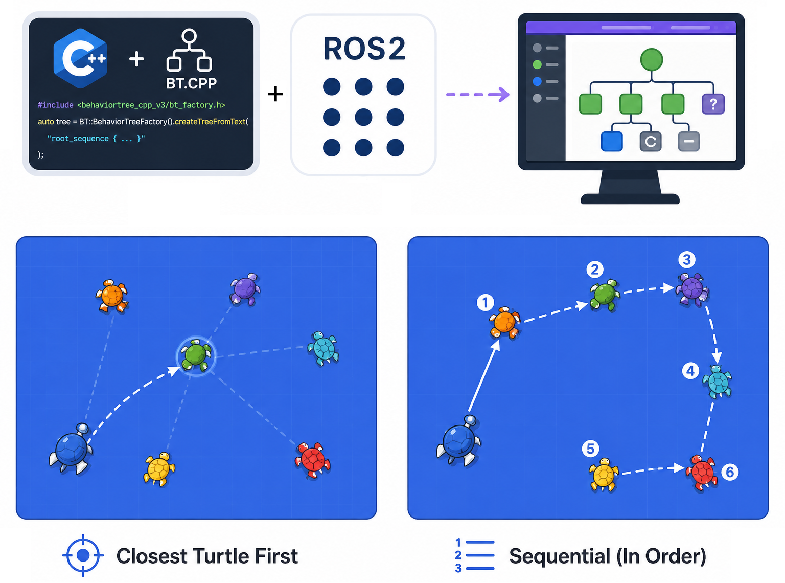

# BehaviorTree.CPP ROS 2 Demo

<p align="center">
  
</p>

A **BehaviorTree.CPP v4** showcase running in a containerized ROS 2 Jazzy environment with live Groot2 visualization.

| Package | What it does | Groot2 port |
|---------|-------------|-------------|
| `bt_turtlesim_ctrl` | Turtlesim prey-hunting demo — a hunter turtle chases and eliminates spawned prey turtles using a behavior tree with two selectable strategies | **1669** |

---

## 🚀 Quick Start

### 1. Build the Docker image

```bash
docker compose build
```

### 2. Start a container shell

```bash
# Interactive (recommended)
docker compose run --rm dev bash

# Or background + attach
docker compose up -d dev
docker compose exec dev bash
```

### 3. Build the ROS 2 workspace

```bash
cd /dev_ws
colcon build --symlink-install
source install/setup.bash
```

### 4. Run a demo

```bash
# 🐢 Turtlesim prey-hunter (sequential strategy)
ros2 launch bt_turtlesim_ctrl turtlesim_bt.launch.py

# 🐢 Turtlesim prey-hunter (closest-first strategy)
ros2 launch bt_turtlesim_ctrl turtlesim_bt.launch.py strategy:=closest
```

Groot2 opens automatically. Click **Connect** and enter the port for the demo.

---

## 🐢 Turtlesim Prey-Hunting Demo

### How it works

1. **`turtle_spawner`** creates a new prey turtle at a random position on the canvas every 2–4 seconds (configurable).
2. **`turtle_controller`** runs a behavior tree that drives `turtle1` to catch and eliminate each prey.
3. Two hunting strategies are available — selected at launch time:

| Strategy | Behavior |
|----------|----------|
| `sequential` | Catch turtles in the order they appeared (FIFO) |
| `closest` | Always chase the nearest turtle first (greedy) |

### Launch options

```bash
# Default (sequential, spawn every 2–4 s, Groot2 enabled)
ros2 launch bt_turtlesim_ctrl turtlesim_bt.launch.py

# Closest-first strategy
ros2 launch bt_turtlesim_ctrl turtlesim_bt.launch.py strategy:=closest

# Faster spawning for testing
ros2 launch bt_turtlesim_ctrl turtlesim_bt.launch.py min_interval:=2.0 max_interval:=4.0

# Without Groot2
ros2 launch bt_turtlesim_ctrl turtlesim_bt.launch.py enable_groot:=false
```

---

## 🌳 Groot2 Visualization

Groot2 launches automatically with every demo. To connect manually:

```bash
~/Groot2.AppImage
```

| Demo | Port |
|------|------|
| `bt_turtlesim_ctrl` | `localhost:1669` |

1. Open Groot2 → click **Connect**
2. Enter the port above
3. The live tree will appear with node status colors

---

## 🐳 Docker Reference

| Command | Description |
|---------|-------------|
| `docker compose build` | Build the image |
| `docker compose run --rm dev bash` | Start interactive container |
| `docker compose up -d dev` | Start in background |
| `docker compose exec dev bash` | Attach to running container |
| `docker compose down` | Stop and remove containers |
| `docker compose logs -f dev` | View logs |

To open a second terminal in a running container:
```bash
docker compose exec dev bash
source /dev_ws/install/setup.bash
```

---

## ⚠️ Troubleshooting

**X11 / Groot2 display issues** — run on the host before starting the container:
```bash
xhost +local:docker
```

**ROS 2 domain isolation** — the container uses `ROS_DOMAIN_ID=42` to avoid conflicts with other ROS 2 nodes on the network.

**Groot2 builtin model warnings** — harmless; suppressed by routing Groot2 output to `log` in the launch file.

**Build order** — `bt_turtlesim_interfaces` must be built before `bt_turtlesim_ctrl`. A plain `colcon build` handles this automatically.

---

## 📝 License

MIT — see [LICENSE](LICENSE) for details.
